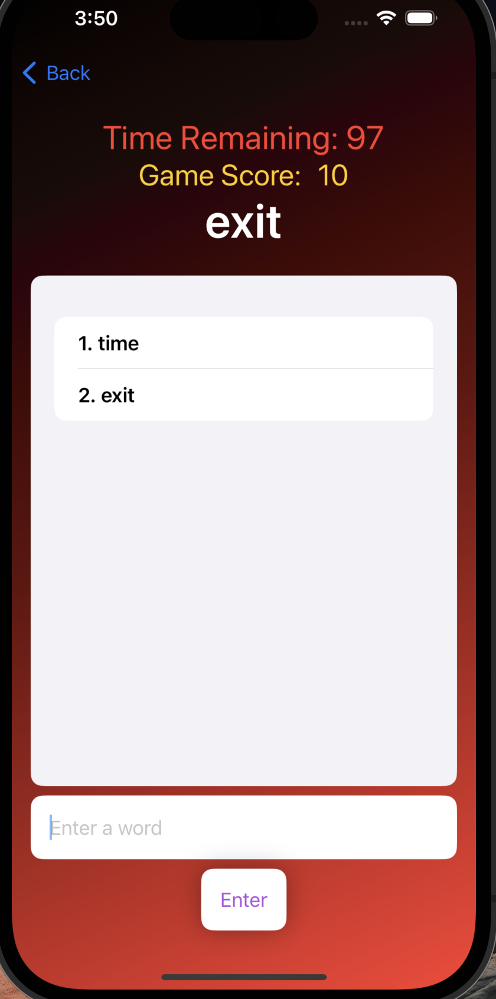
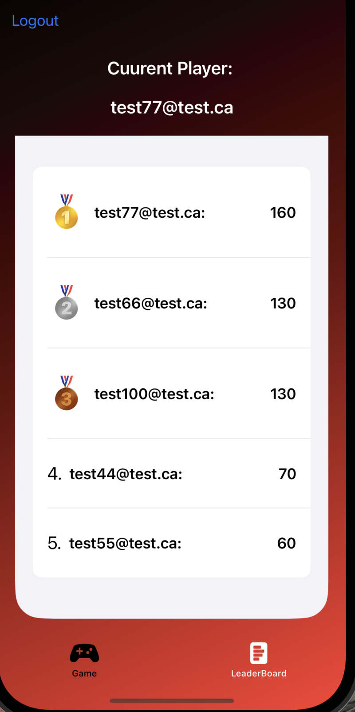

Welcome to the iOS Word War game repository! This game challenges players to score the highest by forming words under specific rules. Enjoy both single-player modes. Below are the instructions for getting started, playing the game, and testing various features.

## Screenshots

  
Game Play

  

  
Leader Board

  

## Getting Started

### Installation
1. Clone the repository to your local machine.
2. Open the project in Xcode.
3. Install all necessary dependencies.
4. Start the simulator to play the game

### Sign up
- To play, users must sign up
- If users do not have credentials then click sign-up button 

## How to Play

### Starting the Game
- On the home screen, click **“How to Play”** for instructions.
- Press **“Start Game”** to begin playing Word War.

### Gameplay
- The objective is to form words and score points.
- After each game, check your score and see where you rank.

### Playing Again or Exiting
- To play again, select **“Play Again”**.
- To return to the home screen, choose **“Go Home”**.
- To log out, click **“Logout”** on the LandingView.

## Features

### Game Complexity
- The computer opponent picks valid words following the game rules.

### APIs Used
- **API Ninja**: Retrieves random words.
- **Dictionary API**: Validates words.
- **DataMuse API**: Assists the computer in picking correct words without validating game rules.

Happy gaming!
